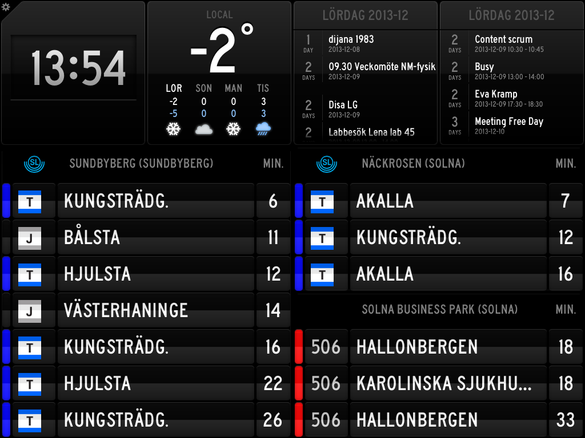

slapi
=====

Aggregating API and view for the trafiklab realtime APIs

## About

This API is inspired by [SB\_SL](https://github.com/carlfranzon/SB_SL). I wanted caching, some filtering and prefer python to PHP, so I wrote this. Images and idea totally stolen from him though.

It tries to be a HTTP REST JSON/HTML API aggregator for the [trafiklab APIs](http://http://www.trafiklab.se).

The HTML renderer can be used as a backend for [Status Board](https://itunes.apple.com/us/app/status-board/id449955536?mt=8&ign-mpt=uo%3D4) custom tables.



## Installation

1) Create and deploy the docker image

Using whatever docker flow suits you, the Dockerfile is in /

2) Mount a /config.yaml file with the following content:

```
departure-key: <key to your trafiklab realtidsinformation 3 api>
station-key: <key to your trafikab platsuppslagnings api>
```

3) Add queries to whatever you have reading the API. In Status Board, add a URL like below to a custom Table widget:

```
http://yourhost.se:port/v1/station-id/departures?distance=5&buses=none&trams=none
```

The station ID is a [unique integer ID](http://console.apihq.com/sl-realtidsinformation) for the station you want departures for.

## API calls

The API has two valid calls:

1) Name of a given station:

```
/v1/station/<id>
```

2) Departures for a given station:

```
/v1/station/<id>/departures
```

## API arguments

The API path is simply the station id (see above), the arguments are as follows:

| Name      | Typ                 | Optional? | Description |
| -------- |:-------------------- |:--------- | ----------- |
| distance | integer              | yes       | How long it takes to get to the station in minutes. Will filter departures that leave in less time. |
| limit    | integer              | yes       | Return at most this many results, regardless of how many available departures there are. |
| alt      | string               | yes       | Return in alternative format. Valid values: json |
| buses    | comma separated list | yes       | Only show these lines for this transportation type. Example: buses=10,20,30. |
| metros   | comma separated list | yes       | Only show these lines for this transportation type. Example: metros=10,20,30. |
| trains   | comma separated list | yes       | Only show these lines for this transportation type. Example: trains=10,20,30. |
| trams    | comma separated list | yes       | Only show these lines for this transportation type. Example: trams=10,20,30. |


The arguments are accepted for all calls, but may not have any effect.


## Bugs

Much like SB_SL, I havn't tested it on every possible station and you might encounter weirdness. Contributions welcome if so.
